## Hi there 👋

### I'm Obi fortune

<!-- 
### `NOT AVAILABLE FOR FULLTIME JOB OFFERS AT THE MOMENT BUT FEEL FREE TO CONTACT ME AND MAYBE WE CAN WORK SOMETHING OUT` 
-->

Welcome to my github 😃

I'm a frontend web developer using Reactjs/NextJS

I also do backend with NodeJs

I'm currently learning ReactNative

##### 📫 feel free to send a mail to [gabrielobi.of@gmail.com](mailto:gabrielobi.of@gmail.com)

<!--
**ickynavigator/ickynavigator** is a ✨ _special_ ✨ repository because its `README.md` (this file) appears on your GitHub profile.

Here are some ideas to get you started:

- 🔭 I’m currently working on ...
- 🌱 I’m currently learning ...
- 👯 I’m looking to collaborate on ...
- 🤔 I’m looking for help with ...
- 💬 Ask me about ...
- 📫 How to reach me: ...
- 😄 Pronouns: ...
- ⚡ Fun fact: ...
-->
